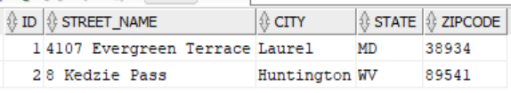
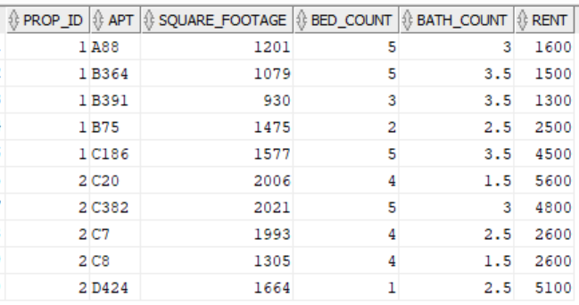
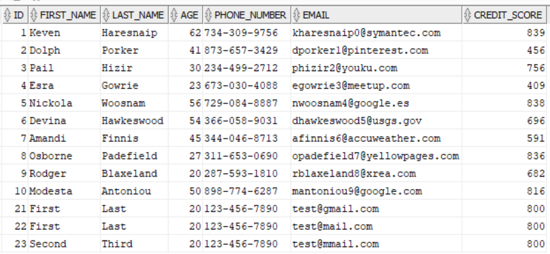
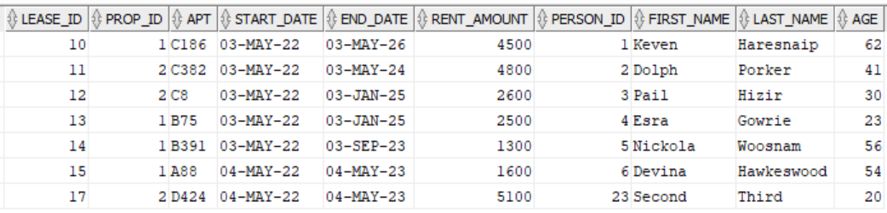

# CSE 241 - Database Systems & Applications

Semester-long project for Lehigh's Spring 2022 CSE 241 course. The goal is to
design a robust database along with separate interfaces for different access
levels at a fictional company, Northside Uncommons Management of Apartments (NUMA).

## Directory Structure

```dir
.
├── db/                       	# Static files for configuring the database [Some scripts are outdated]
|	├── setup.sql				# Brings up the database from scratch
|	├── shutdown.sql			# Shuts down the database taking into account dependencies
|	├── generate.py				# Generate data
|	├── sqlconvert.py			# Converts generated data to SQL statements
|	├── mock/					# Store for generated data
|	├── function/				# PL/SQL Functions
|	├── procedures/				# PL/SQL Procedures
|	├── triggers/				# SQL Triggers
|	├── types/					# SQL Custom Defined Types
|	├── queries/				# Queries used in the console
|	└── updates/				# Database updated used in the console
|
├── numa/src/main/java/numa		# NUMA Console Source Files
|	├── NUMA.java				# Main Driver
|	├── Reader.java				# Console in reader
|	├── Portals/				# Handles all the portal activities
|	└── Exceptions/				# Custom exceptions
|
├── Schema.pdf                  # Database Schema Diagram
├── .git/
├── .gitignore
└── README.md                   # You're reading me!
```

## Mock Data

The following schemas were generated using the aid of [Mockaroo](https://www.mockaroo.com/). The cURL command to access the data is also provided. Add parameters `key` and `count` in the URL to specify your API key and # of entries to generate.

- ACH - `https://api.mockaroo.com/api/d8cc21a0`
- Apartment - `https://api.mockaroo.com/api/98cd9330`
- Pay Card - `https://api.mockaroo.com/api/42551840`
- Person - `https://api.mockaroo.com/api/d41211e0`
- Pet - `https://api.mockaroo.com/api/f8298b90`
- Prev Addr - `https://api.mockaroo.com/api/83abf170`
- Property - `https://api.mockaroo.com/api/8ac165c0`
- Renter Info - `https://api.mockaroo.com/api/bce9b270`
- Venmo - `https://api.mockaroo.com/api/5d5a4450`

### Test Data

Below is some pre-populated data that can be used for testing purposes

Manager PIN: `1337`

Properties:



Apartments:



People:



Leases:



> Note: Not all mock data scripts have been updated. Some of the data values were manually converted to use PL/SQL Procedures/Functions that were implemented later on

## Functions

- Resident Portal (Requires sign-in with a valid resident ID (Person with a lease))
	- My Info - Displays personal information about the resident
	- Make Payment - View upcoming payments and pay for them
	- My Lease Details - View details about their lease and their personal information

- Management Portal (Requires sign-in with a valid PIN)
  - Properties - View properties and apartment details
  - People - View personal information of people on file
  - Lease - Create a new lease or modify a single lease's length
  - Visits - Register a person's tour of an apartment (Add's person information if they don't already exist)
  - Change PIN - change Management Portal's PIN)

### Assumptions

- Payments are made in full (Even for outstanding, late payments)
- Late payments don't have late fees
- Only one lease can be signed to each resident
- Everyone on a lease is treated the same (There are no primary signees)
